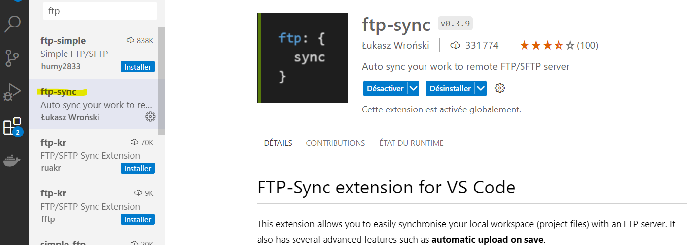

# Avant de commencer

Nous allons installer et configurer ftp-sync pour pouvoir travailler sur le projet en local et le synchroniser avec le serveur Runcloud.

## Installation de ftp-sync

Il suffit de télécharger l'extension :


Ensuite, crée un dossier vide pour le projet en local et ouvre-le dans VSCode. Appuie sur F1 et tape ftp-sync:init. Tu vas créer un dossier .vscode avec un ftp-sync.json à l'intérieur. Ouvre-le et remplace le contenu par ceci :

```json
{
  "remotePath": "./webapps/votre webapp",
  "host": "57.128.65.58",
  "username": "votre user",
  "password": "votre mdp",
  "port": 22,
  "secure": false,
  "protocol": "sftp",
  "uploadOnSave": true,
  "passive": true,
  "debug": false,
  "privateKeyPath": null,
  "passphrase": null,
  "agent": null,
  "allow": [],
  "ignore": ["\\.vscode", "\\.git", "\\.DS_Store", "vendor", "var"],
  "generatedFiles": {
    "extensionsToInclude": [""],
    "path": ""
  }
}
```

## Importer le projet

Pour télécharger et synchroniser le code du projet, il faut utiliser Ftp-sync: Remote to local. Dans un premier temps, l'add-on va scanner le projet puis te demandera d'exécuter le téléchargement.

Ça y est, tu as le projet en local et tu peux commencer à travailler dessus. Chaque sauvegarde sera automatiquement synchronisée avec le serveur Runcloud par un upload FTP.

# TP PrestaShop

Voici une série d'exercices qui te permettront d'explorer les principales fonctionnalités de PrestaShop. Tu es libre sur le choix du thème de ta boutique et sur le choix des produits.

## Produits :

Ajoute 100 produits à ta boutique. Tu peux utiliser des données de test pour les produits. Tu peux aussi utiliser des images de test. Il te faut aussi une dizaine de catégories.

## Gestion des stocks :

Modifie les quantités de stock pour certains de tes produits et teste la fonctionnalité de suivi des stocks de PrestaShop. Teste aussi la fonctionnalité de notification de stock bas et les ruptures de stock.

## Gestion des taxes :

Configure une taxe pour tes produits et vérifie qu'elle est correctement appliquée lors du panier. Configure des produits avec 2 TVA différentes.

## Gestion des promotions :

Crée une promotion sur certains de tes produits et vérifie qu'elle est correctement affichée sur la page du produit et appliquée lors du passage à la caisse. Crée une promotion sur une catégorie de produit. Crée une promotion sur un produit avec une date de début et de fin. Crée une promotion sur un produit avec un code promo. Crée une promotion sur un produit avec une quantité minimum. Crée une promotion pour un client spécifique.

## Gestion des commandes :

Passe une commande en tant que client et teste le processus de gestion des commandes dans le back-office de PrestaShop. Passe la commande en paiement accepté et affiche la facture correspondante.

## Gestion des transporteurs :

Configure les frais de livraison en fonction du poids ou du prix de la commande et vérifie qu'ils sont correctement appliqués lors du passage à la caisse. Ajoute un module de livraison avec un transporteur spécifique. (Colissimo par exemple)

## Personnalisation du thème :

Modifie le thème de ta boutique en changeant les couleurs, les polices et la disposition des éléments. Ajoute un logo et une favicon. Ajoute un thème gratuit depuis le market. (Il faut importer un fichier zip, il n'y a pas de marketplace dans le backoffice de PrestaShop). Modifie les templates depuis les fichiers tpl. Change les bannières de la page d'accueil. Ajoute des pages CMS.

## Gestion des clients :

Crée quelques clients fictifs et teste les fonctionnalités de gestion des clients de PrestaShop, comme l'envoi de newsletters ou la gestion des groupes de clients. Tu peux aussi te rendre sur les boutiques de tes camarades et t'inscrire en tant que client et passer des commandes.

## Analyse des performances :

Utilise les outils d'analyse de PrestaShop pour suivre les performances de ta boutique, comme le nombre de ventes, le taux de conversion ou le panier moyen.```
