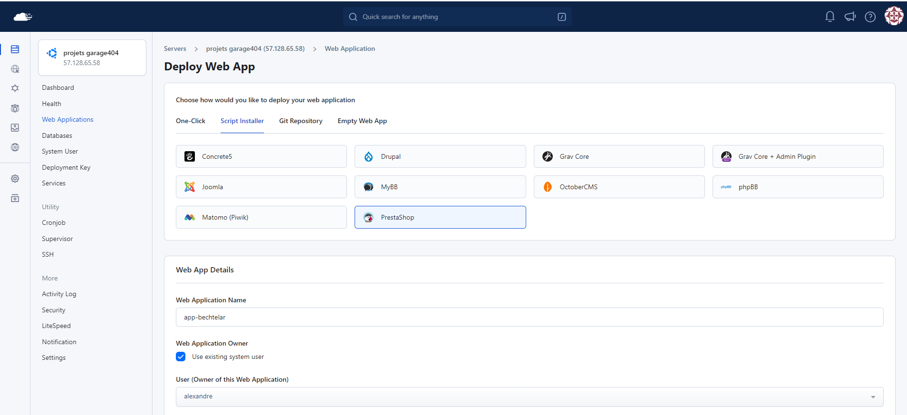
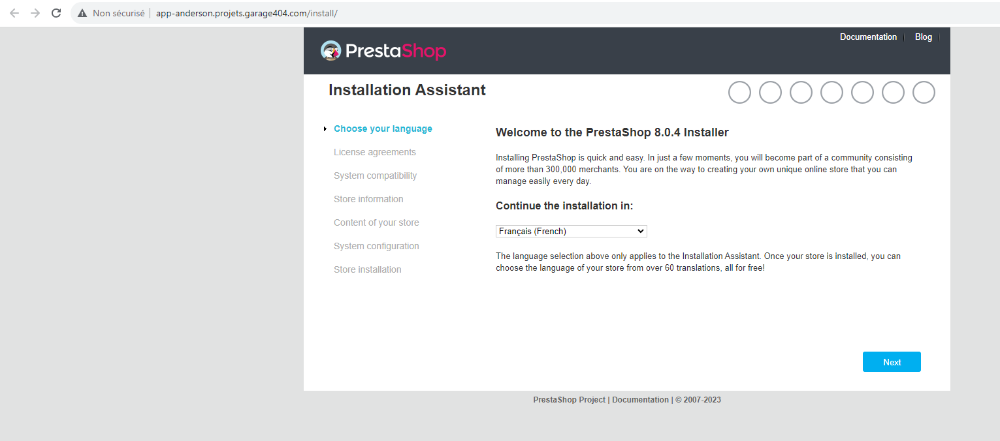
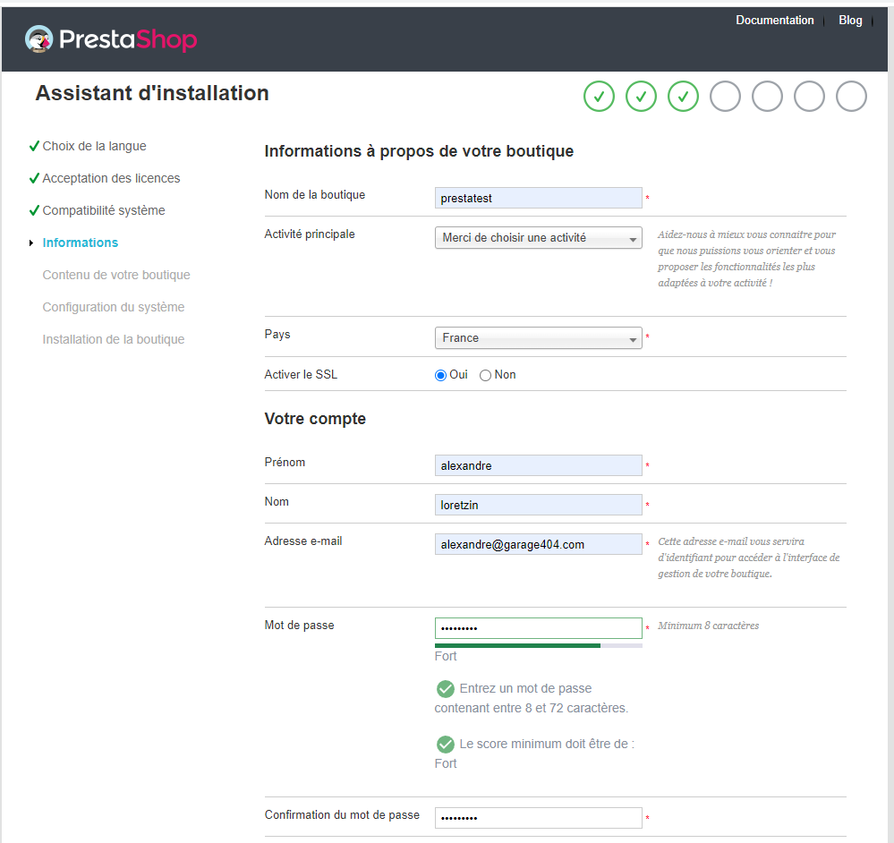
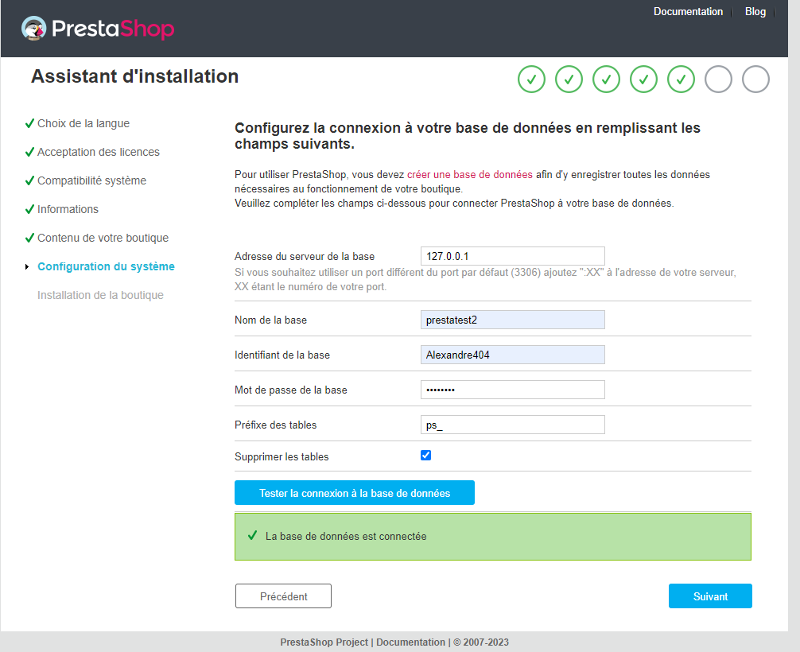
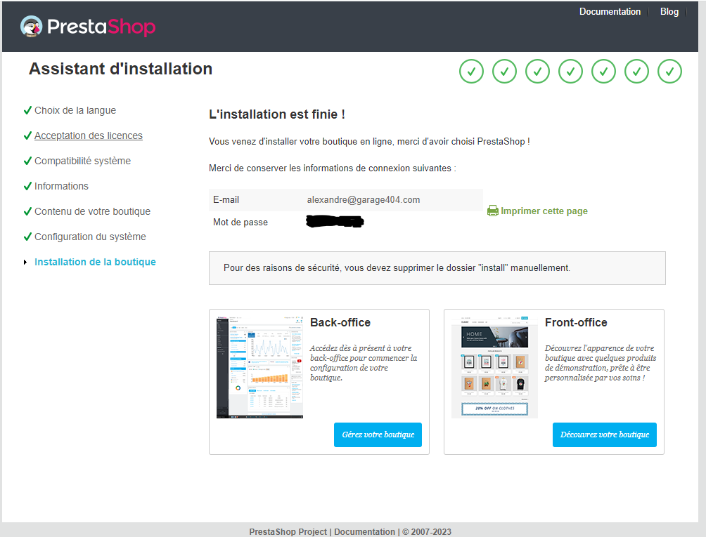
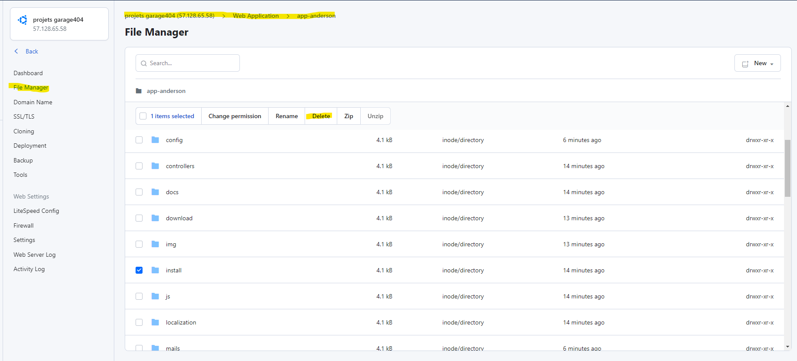

# TP Prestashop

Bonjour à tous,

Aujourd'hui, nous allons nous plonger dans le monde du commerce en ligne avec PrestaShop. PrestaShop est une plateforme de commerce en ligne open source, ce qui signifie que tu peux l'utiliser gratuitement et la modifier pour répondre à tes besoins spécifiques. Elle est utilisée par des milliers de commerçants à travers le monde pour vendre leurs produits en ligne.

## Objectif du TP

L'objectif de ce TP est de te familiariser avec l'installation et la configuration de base de PrestaShop. Nous allons passer par toutes les étapes, de la création d'une base de données à l'installation de PrestaShop sur le serveur Runcloud. Nous allons également explorer le back-office de PrestaShop et voir comment on peut ajouter des produits, gérer les commandes et configurer les paramètres de la boutique.

Ce TP te donnera une bonne base pour commencer à travailler avec PrestaShop. Cependant, PrestaShop est une plateforme très puissante avec de nombreuses fonctionnalités, donc n'hésite pas à explorer par toi-même et à expérimenter avec différentes configurations et extensions.

## Création de la webapp

Sur le serveur Runcloud, nous allons installer PrestaShop avec l'installateur intégré. Crée une webapp avec script installer PrestaShop. Comme pour une webapp classique, mets ton user en owner et coche l'auto SSL. Utilise le nom de domaine [nom de l'app].projets.garage404.com

**ATTENTION !** Il faut installer en PHP 7.4. Si tu utilises 8.0, 8.1 ou 8.2, tu auras une erreur. (L'installateur de PrestaShop sur le serveur Runcloud est un peu en retard)

## Création de la base de données

Avant d'installer PrestaShop, nous devons créer une base de données. Il te suffit de suivre les mêmes étapes que la documentation de déploiement Runcloud.

N'oublie pas le mot de passe de ton database user, il te servira pour l'installation de PrestaShop.

## Installation de PrestaShop

Maintenant que nous avons créé une base de données, nous pouvons installer PrestaShop. Pour ce faire, nous allons utiliser l'installateur PrestaShop intégré. Pour accéder à l'installateur, ouvre ton navigateur et accède à l'URL de ton site Web. Tu devrais voir une page comme celle-ci :

Suis les étapes d'installation, utilise une adresse mail valide pour la création du compte admin. Active le SSL.

Active les données test pour les produits et installe tous les modules par défaut.
Ensuite, entre les identifiants de ton database user du serveur Runcloud.

Tu arriveras sur cette page :

Pour te connecter au back-office, il nous faut faire une opération un peu spéciale : supprimer le dossier d'installation manuellement du serveur. Va dans le file manager de la webapp et supprime-le :

Tu peux maintenant te connecter au back-office avec les identifiants que tu as rentrés lors de l'installation.

Nous allons découvrir ensemble le back-office de PrestaShop. Je te propose une série d'exercices pour te familiariser avec l'interface à retrouver ici : [exercices](exercices.md)
